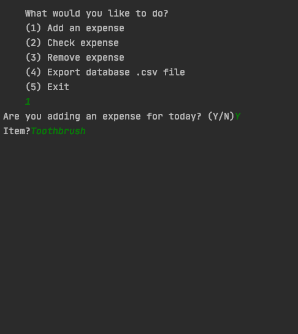

# **ExpenseTracker_v1**
###### A simple expense tracker that utilizes SQLite

## **Description**

Tired of finding out about your empty bank account by the end of each month? Me too. But have no fear, this is a simple script that is written in Python that helps track your daily expenses. It utilizes the built-in SQLite database library that stores the entries in the .db files. Users can also check their expenses monthly and annually in a table format using the `tabulate` library as well as pie charts which uses the `matplotlib` library that helps visualize data.


## **Installation**

### **Clone**
Clone this repo to your local machine using `https://github.com/zhiyifoo/ExpenseTracker_v1.git`

### **Setup**

1. Installing the required packages

> Install the  `matplotlib` library

```
pip install matplotlib
```

> Install the  `tabulate` library

```
pip install tabulate
```

2. Run `base.py`
- Helps initialize and create the SQLite database and the functions for the script to run

3. Run `ExpenseTrackerApp.py`
- Makes the interface cleaner and prompts the user to run the functions in `base.py`


## **Features**

### **1. Add expenses**

The script prompts the user to input an expense for the day itself, mitigating the need to put in the day's date.


If the user chooses to input the year manually, the inputs are all validated by the built-in `daytime` module in Python, which informs the user should their date input is invalid (eg. inserting 13 as a month). 

This feature allows users to add an expense into the database based on a couple of inputs:
- Year
- Month
- Day
- Item
- Catgegory
- Count
- Price



The user will also be prompted to enter another expense after the first one in case they'd like to add multiple entries.


### **2. Check expenses**

While checking expenses, the user is prompted for option to check the expenses for this month, specific month and specific year.


In addition, the user can choose to view the expenses in a table form, which utilizes the `tabulate` package that is required to install.


The user can also choose to view the expenses in a pie chart, which utilizes the `matplotlib` module and lays out the percentage of the different categories.


### **3. Remove expenses**

In case of a mistake, the user could remove the expense from the database by the item's ID which is the row's unique identifier. 


Once the user enters the ID and deletes the expense, the entry is deleted from the database forever.


### **4. Export databse to `.csv` file**

If the user would like to export the database to a csv file and analyze the data using Microsoft Excel or Python's `pandas` module, the script provides an option to do so


## **Limitations**
As seen, the current version of the Expense Tracker doesn't have a GUI. This will be something that will be explored and implemented in the future using the Python de-facto standard GUI Package, `tkinter`. In addition, the categories are currently limited to the ones that were preset and doesn't allow for users to add their own. However, this will be something that will be looked into and improved upon in the next iteration.


## **Support**

Feel free to reach out to me through any of these platforms:

- [Email](foozhiyi@gmail.com)
- [Portfolio Website](zhiyifoo.com)
- [LinkedIn](linkedin.com/in/zhiyifoo/)
